<div align="center">

# 📓 Mentoring Diaries

### AI-assisted student mentoring, from weekly reflection to mentor action.

Students reflect weekly. AI surfaces what matters. Mentors arrive prepared.

[](https://nodejs.org)
[](https://react.dev)
[](https://expressjs.com)
[](https://github.com/WiseLibs/better-sqlite3)
[](https://vitejs.dev)
[](#-testing)

</div>

<p align="center">
  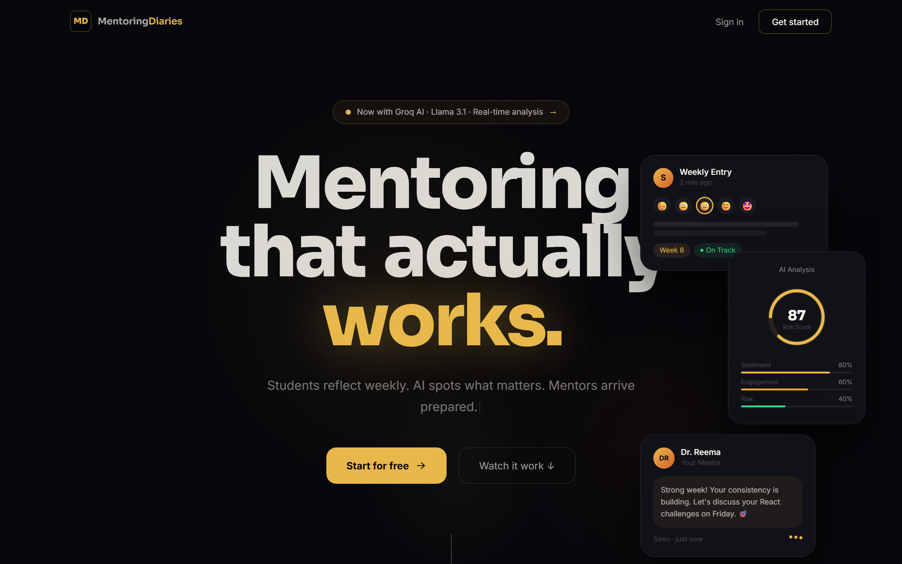
</p>

---

## Overview

**Mentoring Diaries** is a full-stack platform that turns weekly student reflections into
actionable mentoring. Students log a short structured diary each week — mood, per-subject
ratings, attendance, challenges — and an AI layer (Groq / Llama 3.1, with a deterministic
keyword fallback) scores sentiment and risk, flags entries that need attention, and generates
mentor-ready summaries. Mentors get a prioritised queue instead of an inbox; admins get
institution-wide risk, attendance, and engagement analytics.

It ships with three role-based experiences, real-time notifications over Socket.IO, JWT
cookie authentication with silent refresh, CSV exports, and a fully seeded demo database.

## ✨ Key Features

| Role | What they get |
|------|---------------|
| 🎓 **Student** | Weekly diary submission with per-subject ratings, a semester heatmap, wellbeing & risk scores, growth timeline, achievements portfolio, and mentoring sessions. |
| 🧑‍🏫 **Mentor** | Priority queue sorted by urgency, flagged-entry triage, per-student drill-downs, cohort analytics (risk, mood, attendance, response time), and session scheduling. |
| 🛡️ **Admin** | Institution overview, department & section reports, risk monitor, mentor management, user administration, and CSV analytics/flagged-entry exports. |

**Platform-wide**
- 🤖 **AI analysis** — sentiment, 0–100 risk score, risk level, auto-flagging, and weekly insight generation (Groq OpenAI-compatible API, graceful keyword fallback when no key is set).
- 🔔 **Real-time** — Socket.IO pushes notifications and live query invalidation to every role.
- 🔐 **Secure auth** — httpOnly JWT access/refresh cookies, silent refresh, CSRF protection, Helmet, rate limiting, and role-based access control.
- 📊 **Analytics** — Chart.js dashboards across student, mentor, and admin views.

## 📸 Screenshots

### Student
<table>
  <tr>
    <td width="50%">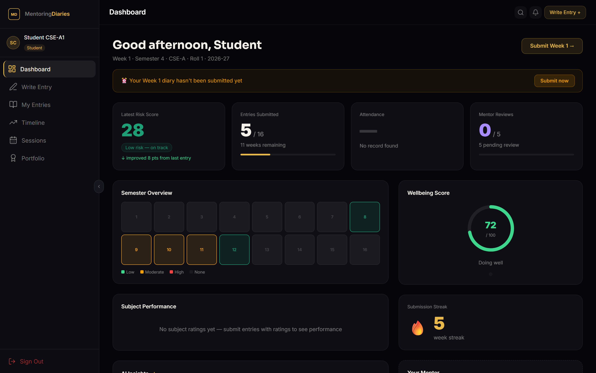<br><sub><b>Dashboard</b> — risk score, semester heatmap, wellbeing & streak</sub></td>
    <td width="50%">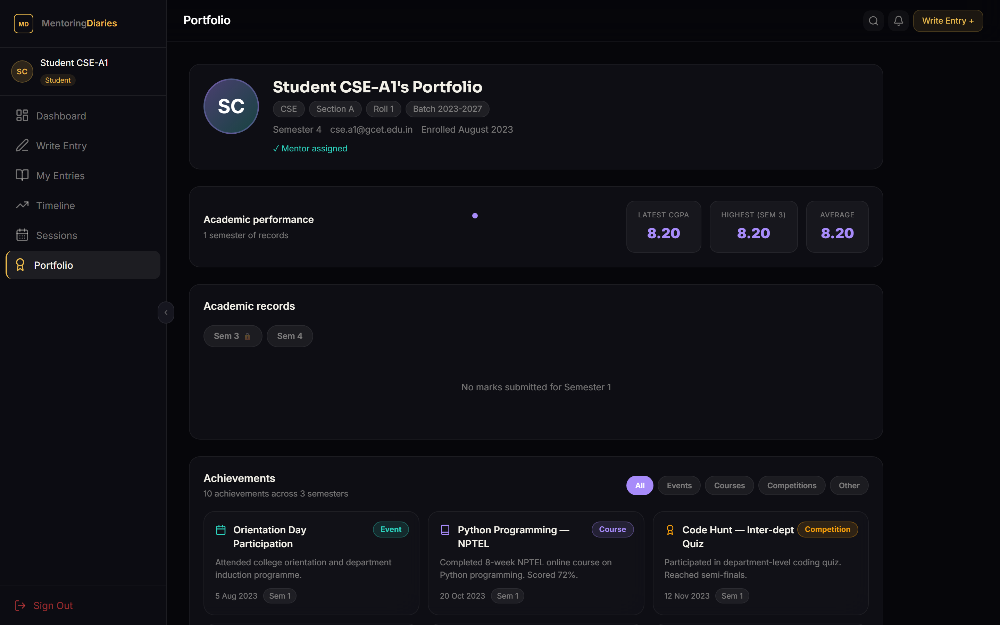<br><sub><b>Portfolio</b> — CGPA history, academic records, achievements</sub></td>
  </tr>
  <tr>
    <td width="50%">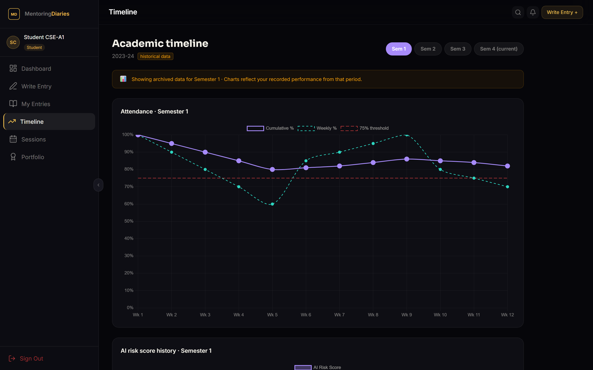<br><sub><b>Timeline</b> — mood, attendance & risk trends over the semester</sub></td>
    <td width="50%">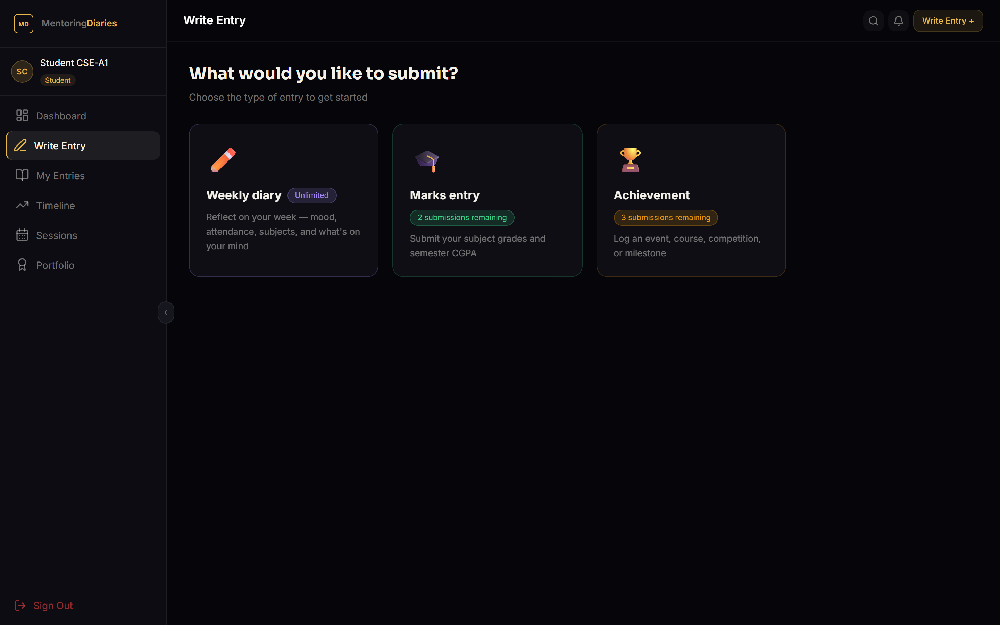<br><sub><b>Submit entry</b> — structured weekly reflection</sub></td>
  </tr>
</table>

### Mentor
<table>
  <tr>
    <td width="50%">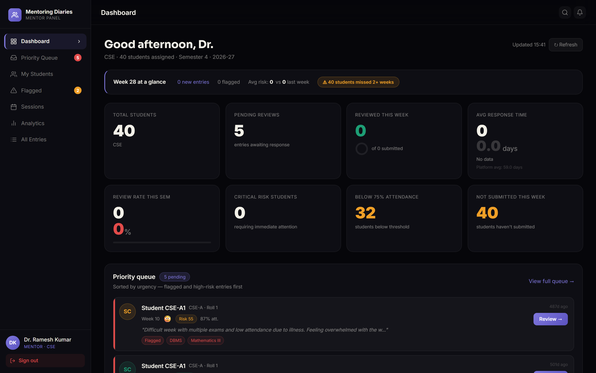<br><sub><b>Dashboard</b> — at-a-glance stats and priority queue</sub></td>
    <td width="50%">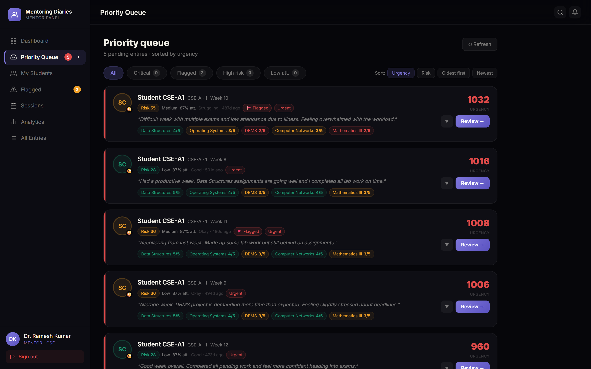<br><sub><b>Priority queue</b> — flagged & high-risk entries first</sub></td>
  </tr>
  <tr>
    <td colspan="2">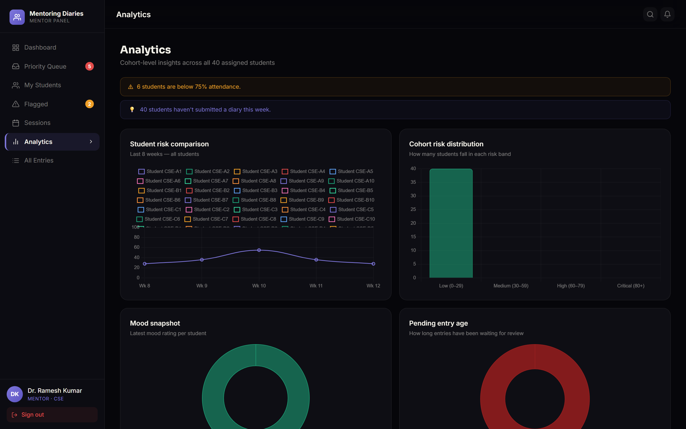<br><sub><b>Analytics</b> — cohort risk comparison, distribution, mood & pending-entry age</sub></td>
  </tr>
</table>

### Admin
<table>
  <tr>
    <td width="50%">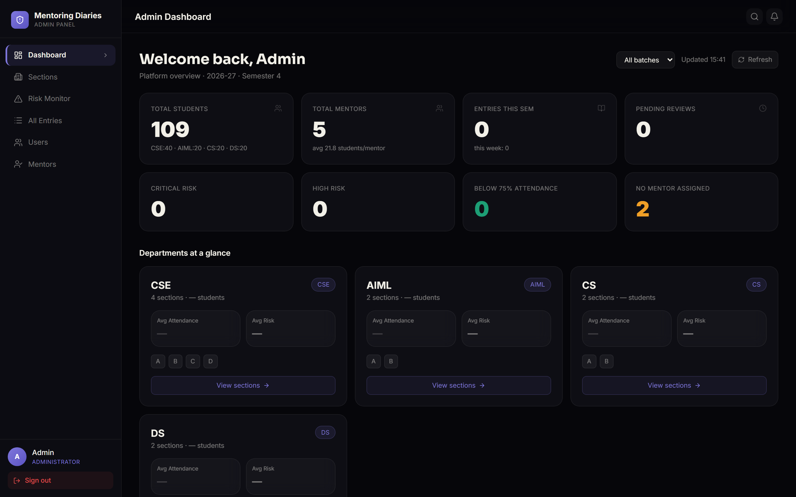<br><sub><b>Dashboard</b> — platform overview & departments at a glance</sub></td>
    <td width="50%">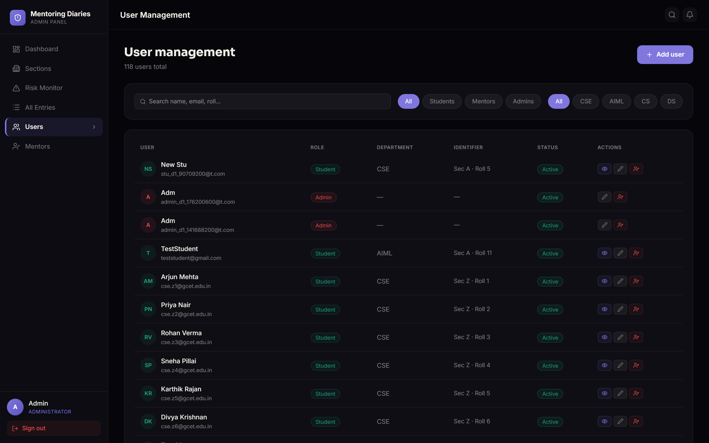<br><sub><b>User management</b> — search, filter, create & manage users</sub></td>
  </tr>
  <tr>
    <td colspan="2">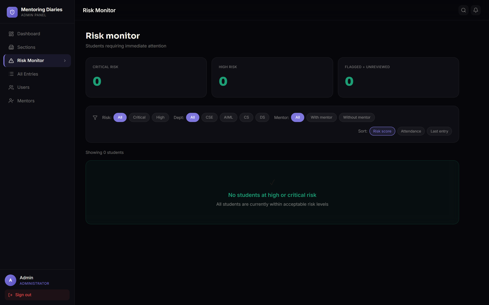<br><sub><b>Risk monitor</b> — students needing immediate attention</sub></td>
  </tr>
</table>

## 🧱 Tech Stack

**Frontend** — React 19 · Vite 7 · React Router 7 · TanStack Query 5 · Zustand 5 ·
Framer Motion · Chart.js · React Three Fiber · Socket.IO client · React Hook Form + Zod ·
Tailwind CSS 4 · Axios

**Backend** — Node.js · Express 4 · better-sqlite3 · JSON Web Tokens · Socket.IO ·
bcryptjs · Helmet · express-rate-limit · express-validator · Multer · Pino · Groq
(OpenAI-compatible) SDK

**Testing** — Jest · Supertest (31 integration tests)

## 🏗️ Architecture

```
MentoringDiaries/
├── client/                 # React + Vite SPA
│   └── src/
│       ├── pages/          # Role-based pages (student / mentor / admin / public)
│       ├── components/     # Layout, UI, charts, auth widgets
│       ├── services/       # axios instance, query client, socket
│       ├── store/          # Zustand stores (auth, notifications, UI)
│       └── utils/          # formatters, ISO week helpers
└── server/                 # Express API
    └── src/
        ├── controllers/    # Route handlers (auth, diary, analytics, mentor, admin…)
        ├── database/       # schema, prepared-statement queries, seed
        ├── middleware/     # auth, CSRF, rate limiting, validation, error handling
        ├── routes/         # REST route definitions
        ├── services/       # AI analysis, CSV export
        └── socket/         # Socket.IO wiring
```

The API is a classic layered Express app: routes → middleware (auth, role check, validation)
→ controllers → a `queries.js` data layer built on parameterised `better-sqlite3` prepared
statements. The SQLite schema auto-initialises and seeds on first run.

## 🚀 Getting Started

### Prerequisites
- Node.js 18+
- npm

### 1. Clone & install

```bash
git clone https://github.com/murthyroshan/MentoringDiaries.git
cd MentoringDiaries

# Backend
cd server && npm install

# Frontend
cd ../client && npm install
```

### 2. Configure the backend

```bash
cd server
cp .env.example .env
```

Set strong secrets in `server/.env` (both must be **at least 32 characters** — the server
refuses to start otherwise):

| Variable | Description |
|----------|-------------|
| `PORT` | Backend port (default `5000`). |
| `NODE_ENV` | `development` \| `test` \| `production`. |
| `JWT_SECRET` | Access-token signing secret (≥ 32 chars). |
| `JWT_REFRESH_SECRET` | Refresh-token signing secret (≥ 32 chars). |
| `JWT_EXPIRES_IN` / `JWT_REFRESH_EXPIRES_IN` | Token lifetimes (e.g. `15m`, `7d`). |
| `CLIENT_ORIGIN` | Allowed frontend origin(s) for CORS/Socket.IO (default `http://localhost:5173`). |
| `GROQ_API_KEY` | Optional. Enables live AI analysis; without it a keyword-based fallback is used. |
| `AI_MODEL` | Groq model (default `llama-3.1-8b-instant`). |
| `AI_TIMEOUT_MS` | AI request timeout (default `5000`). |

> **Note:** A pre-seeded SQLite database ships in `server/data/`, so the app has demo data out
> of the box. On a fresh/empty database the server auto-seeds on first start.

### 3. Run

```bash
# Terminal 1 — API on http://localhost:5000
cd server && npm run dev

# Terminal 2 — client on http://localhost:5173
cd client && npm run dev
```

Open **http://localhost:5173**.

## 🔑 Demo Accounts

| Role | Email | Password |
|------|-------|----------|
| Admin | `admin@gcet.edu.in` | `Admin@123` |
| Mentor | `mentor1@gcet.edu.in` | `Mentor@123` |
| Student | `cse.a1@gcet.edu.in` | `Student@123` |

Student emails follow `<dept>.<section><roll>@gcet.edu.in` (e.g. `aiml.b3@gcet.edu.in`).

## 🔌 API Overview

All routes are under `/api`. Protected routes require the JWT access cookie (or a
`Bearer` token) and, where relevant, a specific role.

| Area | Base path | Highlights |
|------|-----------|------------|
| Auth | `/api/auth` | `register`, `login`, `refresh`, `logout`, `me` |
| Diary | `/api/diary` | submit entries, flagged queue, priority queue, mentor responses |
| Analytics | `/api/analytics` | overview, risk/sentiment distribution, portfolio, weekly insights |
| Attendance | `/api/attendance` | student attendance & history |
| Marks / Achievements | `/api/marks`, `/api/achievements` | academic records & portfolio items |
| Sessions | `/api/sessions` | mentoring session scheduling |
| Mentor | `/api/mentor` | dashboard summary, subject concerns, comparisons |
| Admin | `/api/admin` | sections, reports, risk alerts, user creation, mentor assignment |
| Notifications | `/api/notifications` | list & mark read |

## 🧪 Testing

```bash
cd server
npm test        # Jest + Supertest — 31 integration tests
```

Seed helpers:

```bash
npm run seed:admin        # create an admin
npm run seed:attendance   # generate attendance data
```

## 🔒 Security

- httpOnly JWT access + refresh cookies with silent refresh and refresh-token rotation
- CSRF protection on mutating `/api` requests
- Helmet security headers + CSP (production), CORS allow-list
- Per-route rate limiting (separate budgets for login vs. token refresh)
- bcrypt password hashing, role-based authorization, and ownership checks throughout
- CSV exports are hardened against spreadsheet formula injection

### Known limitations
- **Open admin self-registration** is enabled for demo convenience; disable it before any
  real deployment.
- Refresh tokens are single-session per user (one active device); a multi-session store is
  future work.

## 📄 License

Released under the MIT License.

---

<div align="center">
<sub>Built with React, Express, SQLite, and Groq AI.</sub>
</div>
